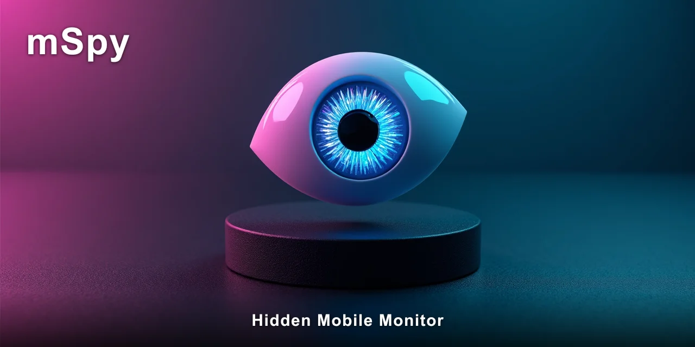

# How to Use a Hidden Mobile Monitor for Beginners

A hidden mobile monitor is software installed on a phone that records activity in the background without the person using the device knowing it's there. It captures messages, calls, location, and app usage, then sends that data to a secure online dashboard you can view from your own phone or computer.

In practice, this kind of tool tends to be used by parents wanting to keep an eye on a teenager's digital life.

> [!NOTE]
> **Quick answer:** A hidden mobile monitor runs silently on a target phone and uploads activity data to a web panel you log into. It usually needs physical access to the device for setup. Android phones require a one-time install, while iPhones can often be monitored through iCloud credentials without touching the device.

The gap between what people expect and what these tools actually deliver is where most of the confusion lives. I've watched parents assume they'll see every keystroke in real time, then feel let down when the dashboard shows a 10-minute delay. That gap is what this guide is for.

Most people begin with the comfortable assumption that any monitoring tool will show them everything instantly, like a live camera feed of the phone's screen. The reality is more layered — some data arrives quickly, other data takes time to sync, and a few things won't show up at all unless you set them up correctly in advance.

✅ **[mSpy was built for this specific kind of monitoring rather than adapted to it.](https://redirectseo.com/m-en)**

## Contents

- [What Is a Hidden Mobile Monitor and How Does It Work?](#what-is-a-hidden-mobile-monitor-and-how-does-it-work)
- [What Can You Actually See and Track?](#what-can-you-actually-see-and-track)
- [What Do You Need Before You Start?](#what-do-you-need-before-you-start)
- [Step-by-Step: How a Beginner Gets Started](#step-by-step-how-a-beginner-gets-started)
- [What to Expect in the First Week](#what-to-expect-in-the-first-week)
- [Frequently Asked Questions](#frequently-asked-questions)
- [✅ Fast Recap](#-fast-recap)

## What Is a Hidden Mobile Monitor and How Does It Work?

A hidden mobile monitor is a piece of software that runs in the background of a phone, collecting data and sending it to a server you can access through a web browser. The "hidden" part means it leaves no visible icon on the home screen, no notification when it starts, and no obvious sign it's running.

The app's name is usually disguised or the icon is hidden entirely.

The way it works depends on the operating system. On Android, the software is installed directly onto the device as an APK file.

Once installed, it requests permissions — things like Notification access, Accessibility, and Usage access — that let it read incoming messages, log keystrokes, and track location in the background. On iPhone, the process is different.

There's no direct install. Instead, the monitor uses the phone's iCloud backup to pull data — messages, call logs, photos — without ever touching the physical device.

All the collected information appears in a web-based control panel. You log in from any browser, and the panel organizes everything into sections: messages, calls, location history, social media activity, and so on. That's the entire system in one paragraph. The complexity, as with most things, is in the details.

| Term | What It Actually Means |
| --- | --- |
| `APK` | The Android installation file format. You'd download this file and open it on the target phone to install the monitor. |
| `Dashboard` | The web-based control panel where you view all collected data. Accessible from any device with a browser. |
| `Geofencing` | A virtual boundary you set on a map. You get an alert when the phone enters or leaves that area. |
| `Keylogger` | A feature that records every keystroke typed on the phone, including passwords and search terms. |
| `iCloud sync` | Apple's cloud backup system. iPhone monitoring often works by reading data from this backup rather than the phone itself. |

One thing I've noticed about first-time users is they tend to overestimate how much happens in real time. The dashboard updates, yes, but there's usually a delay of a few minutes between when something happens on the phone and when it appears on your screen. That's not a flaw — it's how the data syncs.

## What Can You Actually See and Track?

Here's what a hidden mobile monitor realistically shows you, based on what I've observed across years of watching parents use these tools:

- **Text messages:** Both sent and received SMS, with timestamps and contact names.
- **Call history:** Incoming, outgoing, and missed calls with duration and contact details.
- **GPS location:** Real-time position plus a history of where the phone has been.
- **Social media:** Messages from `WhatsApp`, `Snapchat`, `Instagram`, `Facebook`, `Telegram`, and `Viber`, depending on the tool.
- **Browser history:** Websites visited, even in private browsing mode on some setups.
- **App usage:** Which apps are installed, how often they're opened, and for how long.

That's the honest list of what works. Now here's what doesn't work, or what people commonly misunderstand:

- **Deleted messages:** Some tools can recover deleted messages, but only if they arrived after installation. Old deleted conversations are usually gone.
- **Real-time screen viewing:** You can't watch the screen live like a video feed. You see captured data after it syncs.
- **End-to-end encrypted calls:** Voice calls on `WhatsApp` or `Signal` are not recordable by most monitoring tools.
- **Passwords:** A keylogger can capture typed passwords, but auto-filled passwords from a password manager won't show up.

When I talk to parents about what they expect, the biggest disappointment is almost always around deleted messages. They assume the tool has been recording everything since the phone was purchased. In reality, it only captures what happens after installation. That distinction matters more than any other single fact.

> [!WARNING]
> Beginners most often overestimate the real-time aspect. Data syncs in batches, not instantly. Expect a delay of 5 to 15 minutes between the event on the phone and it appearing in your dashboard.

For a beginner, the practical takeaway is this: the tool shows you a pattern of behaviour, not a live feed. You'll see the last 30 days of activity laid out in a readable format, which is usually enough to spot concerning trends.

Honestly, the pattern view is more useful than a live feed would be — you can see the gradual escalation of screen time, the late-night messaging, the location changes that don't match what your teenager told you.

I've seen parents catch serious issues this way — not by catching a single message in the moment, but by noticing a pattern over a week. That's what a hidden mobile monitor is actually for.

The thing is, the setup process is where most beginners stumble. It's not technically difficult, but it requires following specific steps in the right order.

📌 **[mSpy logs this in the background and keeps the history available afterwards.](https://redirectseo.com/m-en)**

## What Do You Need Before You Start?

Before you install anything, take stock of what you have and what you'll need. This is the preparation stage, and skipping it causes most setup failures.

- [ ] Physical access to the target phone for about 10 minutes (Android only)
- [ ] The iCloud email and password for the target iPhone (if monitoring an iPhone)
- [ ] A valid subscription to a monitoring service — most charge monthly or yearly
- [ ] Legal consent — this is non-negotiable and varies by jurisdiction

The physical access requirement is the one that surprises most people. For Android devices, you need to unlock the phone and install the app yourself. That means you need the phone in your hands, unlocked, for roughly 10 minutes. You also need to allow installations from unknown sources, which is a setting buried in `Settings → Security → Unknown sources`.

For iPhones, the process is entirely different. You don't need the phone at all. You need the Apple ID email and password. The monitoring service then reads data from the iCloud backup. This works because iCloud backs up messages, call logs, and photos automatically, and the monitoring service accesses that backup with your credentials.

Cost is the next consideration. A decent hidden mobile monitor runs between $30 and $80 per month, depending on the features you need. The cheapest plans usually cover basic calls and texts. The more comprehensive plans include social media monitoring, keylogger, and geofencing. Annual plans typically cost less per month than monthly plans.

The learning curve is real but manageable. Most people figure out the dashboard within an hour. The setup itself takes about 20 minutes from start to finish, including the install and the initial sync. The first data usually appears within 15 minutes of installation.

One thing I always tell beginners: check your local laws before you start. In most places, monitoring a minor child's phone is legal if you own the phone or have parental rights.

Monitoring an adult without their knowledge is illegal in many jurisdictions. This isn't a gray area — it's a legal requirement that varies from state to state and country to country.

> [!IMPORTANT]
> Consent is not optional. If you're monitoring an adult, you need their explicit permission. If you're monitoring a child, check your local laws — some regions require the child to be informed that monitoring software is installed.

## Step-by-Step: How a Beginner Gets Started

Here's the exact process I recommend to every beginner. Follow these steps in order, and you'll have the monitor running within 20 minutes.

1. **Choose your monitoring service and subscribe.** Pick a reputable tool with good reviews. You'll receive login credentials for the web dashboard.
2. **Create an account on the service's website.** Use the email and password you'll use for the dashboard. Keep these secure.
3. **For Android: enable installation from unknown sources.** Go to `Settings → Security → Unknown sources` and toggle it on. This allows the APK file to install.
4. **For Android: install the APK file.** Download the installation file from the link in your account dashboard. Open it and follow the on-screen prompts. The install takes about 2 minutes.
5. **For iPhone: enter the iCloud credentials.** Log into your dashboard and enter the target phone's Apple ID email and password. The service will then sync with the iCloud backup.
6. **Grant all requested permissions.** On Android, the app will ask for `Notification access`, `Accessibility`, and `Usage access`. Grant all of them. Each one enables a different data type.
7. **Log into your dashboard and verify data is syncing.** Wait 10–15 minutes, then check that messages or location data appears. If nothing shows, revisit the permissions.

The permissions step is where most installations fail. The app needs those three permissions to read messages, track location, and log keystrokes. If you skip one, that data type simply won't appear in your dashboard. There's no error message — it just silently doesn't work.

> [!TIP]
> The biggest time-saver: run the initial setup at night when the phone owner is asleep. This gives you a full 10 minutes with the phone, and the first data sync happens overnight, so you wake up to a populated dashboard.

After installation, hide the app icon. Most monitoring tools have a "hide icon" feature in their settings. On Android, you can also disable the app in `Settings → Apps` so it doesn't appear in the recent apps list. This is what makes the monitor "hidden mobile" in practice.

One more thing about the dashboard — take 10 minutes to explore it before you need it. Click through each section. See where the messages appear, where the location map is, how the geofencing alerts work. Knowing the layout in advance means you won't be fumbling when you actually need to find something quickly.

## What to Expect in the First Week

The first week with a hidden mobile monitor is a period of adjustment. Your expectations and the reality will likely diverge in specific, predictable ways.

| What Beginners Expect | What Actually Happens |
| --- | --- |
| Instant, real-time updates of every action | Data syncs every 5–15 minutes, so there's a noticeable delay between action and visibility |
| Complete history from before installation | Only data that arrives after setup is captured — old messages and calls are not retroactively recovered |
| See everything on every platform | Social media coverage varies; some apps like `Signal` or encrypted calls are not accessible |
| Battery drain or detection on the target phone | Modern tools are designed to be lightweight — most users never notice the phone behaving differently |

That first day is usually a mix of excitement and frustration. You'll see messages appear, and that's validating. But you'll also notice gaps — a conversation that doesn't show up, a location that seems stale. That's not the tool failing. That's the difference between what the tool can access and what it can't.

By day three, most parents settle into a rhythm. They check the dashboard once or twice a day, usually in the morning and evening. They look for patterns rather than individual messages. This is where the tool becomes genuinely useful — not as a surveillance device, but as a way to understand what's happening in a teenager's digital life.

By the end of the week, you'll know exactly what the tool can and can't do for your situation. You'll have a sense of which data is reliable and which is spotty. You'll have adjusted your expectations to match the tool's capabilities.

Honestly, the sync delay caught me out when I first started — it's closer to 15 minutes than real time, and that changes how you use the dashboard. You stop checking for immediate updates and start looking at the bigger picture.

> [!IMPORTANT]
> The hardest mistake to undo is telling the person you're monitoring that the tool exists. Once they know, they can disable permissions, reset the phone, or change their iCloud password — and you can't undo that knowledge. If you're going to use a monitor, keep it to yourself unless the law requires disclosure.

Now, after a week of using the tool, you'll have a clear picture of what's happening. The question becomes what to do with that information.

That's where the real work begins — not in the monitoring, but in the conversations you have because of what you've seen. The tool gives you facts.

What you do with them is up to you.

By this point, you understand the mechanics, the limitations, and the rhythm of using a hidden mobile monitor. You've seen the data flow in, you've adjusted your expectations, and you're using the dashboard with confidence.

⚡ **[See how mSpy handles this specific case](https://redirectseo.com/m-en)**

## Frequently Asked Questions

### Can someone tell if a hidden mobile monitor is on their phone?

Modern monitoring tools are designed to be invisible. There's no icon, no notification, and no obvious battery drain. That said, a tech-savvy person might check `Settings → Apps` and notice an unfamiliar app. On Android, the app can be hidden mobile from the launcher but may still appear in the app list unless specifically disabled there.

### Is it legal to use a hidden mobile monitor on my child's phone?

In most jurisdictions, monitoring your minor child's phone is legal if you own the device or have parental rights. Some countries require that the child knows about the monitoring. For adults, consent is always required — monitoring an adult without their knowledge is illegal in most places and could have serious legal consequences.

### How long does installation take on an Android phone?

About 10 minutes if you know what you're doing. The actual install takes 2 minutes, but granting permissions and hiding the icon takes a few more. Add another 10–15 minutes for the first data sync to populate the dashboard.

### Will the monitor work if the phone is turned off or in airplane mode?

No. The app needs an active internet connection to upload data. If the phone is off or in airplane mode, data accumulates locally and syncs when the connection returns. You'll see a gap in the timeline for that period.

### Can a hidden mobile monitor track Snapchat or WhatsApp messages?

Yes, most tools can read `WhatsApp` and `Snapchat` messages, but the method differs. On Android, the app reads notifications and accessibility data. On iPhone, it reads from the iCloud backup. There are limitations — disappearing messages on Snapchat may not always be captured, and encrypted calls are not accessible.

### What happens if the target phone gets a software update?

Software updates on Android rarely break monitoring apps, but they can sometimes revoke permissions. After an update, check that the app still has `Notification access` and `Accessibility` enabled. On iPhone, iOS updates can change iCloud backup behavior, which might delay data syncing.

### Is a hidden mobile monitor the same as a phone tracker?

Not exactly. A phone tracker typically only shows location. A hidden mobile monitor is broader — it captures messages, calls, social media, browser history, and app usage in addition to location. Think of a tracker as one feature within a monitor, not the whole tool.

## ✅ Fast Recap

- A hidden mobile monitor records messages, calls, location, and app activity without visible signs on the phone.
- Android requires physical access for about 10 minutes; iPhone works through iCloud credentials without touching the device.
- Data syncs every 5–15 minutes, not in real time — adjust your expectations accordingly.
- Only data after installation is captured; old messages and calls are not retroactively recovered.
- Consent and local laws matter — check before you install anything on someone else's phone.
- Grant all permissions during setup, or certain data types will silently not appear.
- Hide the app icon after installation to keep the monitor truly hidden.